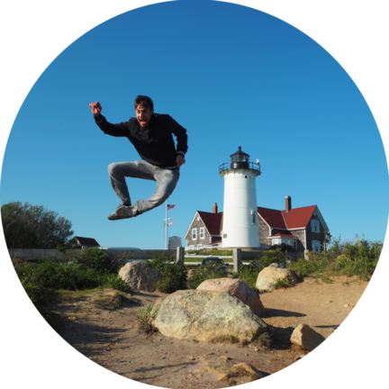

---

Hi there! I am currently an Intern at [Google DeepMind](https://deepmind.google/) and a PhD student in **Machine Learning** at the [University of Bristol](https://www.bristol.ac.uk/) (UK). My research interests lie at the intersection of **3D Deep Learning, Neural Fields and 3D Gaussian Splatting,** and **Robotics Perception** (Computer Vision, Tactile Sensing). I have a soft spot for **Computer Graphics** and **Physically-Based Rendering**. I am supervised by [Prof Nathan Lepora](https://lepora.com/) and [Dr Laurence Aitchison](http://www.gatsby.ucl.ac.uk/~laurence/), and I am fortunate to collaborate with and get guidance from [Alessio Tonioni](https://alessiotonioni.github.io/) (Google) and [Jonathan Tremblay](https://research.nvidia.com/person/jonathan-tremblay) (NVIDIA). Previously, I worked as a Machine Learning research engineer in autonomous driving at the Netherlands Organisation for Applied Scientific Research (TNO), where I worked and led EU-funded projects on autonomous driving, and developed **Deep Reinforcement Learning** applications for self-driving vehicles.

I read papers following Andrew Ng's invaluable tips on <a href="https://youtu.be/733m6qBH-jI">How to read research papers (Andrew NG)</a>

### Publications


    
    

        <a href="{{ publication.link }}"><strong>{{ publication.title }}</strong></a> {{ publication.authors }} - {{ publication.status }}
        <!-- <strong>{{ publication.title }} [</strong><a href="{{ publication.link }}">PDF</a> {{ publication.authors }} - {{ publication.status }} -->
    



### Reading group

I run an online **3D Deep Learning reading group**, where we discuss papers in 3D Vision for the virtual and physical world. If you are interested or want to join, please visit the [reading group website](https://3d-deeplearning-rg.github.io/).  

### Teaching
- **[Introduction to AI](https://www.bris.ac.uk/unit-programme-catalogue/UnitDetails.jsa?ayrCode=22%2F23&unitCode=EMATM0044), Teaching Assistant**, BSc unit, MSc unit, @University of Bristol, 2021/2022, 2021/2023
- **Anomaly Detection using Machine Learning, Guest Lecturer** @Jheronimus Academy of Data Science, July 2021

### Talks
- **A Hybrid-AI approach to Competence Assessment for Automated Driving Functions** @SafeAI AAAI, February 2021

### Updates
- In October 2024, our work *Neural Fields in Robotics: A Survey* was submitted to Arxiv ([link](https://arxiv.org/pdf/2410.20220v1)).
- In September 2024, I started my internship as Student Researcher at **Google DeepMind**!
- In May 2024, our work *TouchSDF: A DeepSDF Approach for 3D Shape Reconstruction Using Vision-Based Tactile Sensing* was accepted into the [IEEE RA-L journal](https://ieeexplore.ieee.org/abstract/document/10517361).
- In April 2024, the 3D Deep Learning Reading Group I am running is starting again. Join us [here](https://3d-deeplearning-rg.github.io/).
- Our work *Snap-it, Tap-it, Splat-it: Tactile-Informed 3D Gaussian Splatting for Reconstructing Challenging Surfaces* was submitted to Arxiv ([link](https://arxiv.org/abs/2403.20275)).
- Our work *TouchSDF: A DeepSDF Approach for 3D Shape Reconstruction Using Vision-Based Tactile Sensing* was accepted to the Touch processing in AI workshop at **NeurIPS 2024**. See you in New Orleans!
- Our work *TouchSDF: A DeepSDF Approach for 3D Shape Reconstruction Using Vision-Based Tactile Sensing* was accepted to the 3D Vision and Robotics workshop at **CVPR 2023**. See you in Vancouver!
- Our work *Implicit Neural Representation for 3D Shape Reconstruction Using Vision-Based Tactile Sensing* was accepted to the workshop ViTac: Blending Virtual and Real Visuo-Tactile Perception at **ICRA 2023**. See you in London!
- In September 2021, I started my PhD in Machine Learning at the University of Bristol.
- Our work *A Hybrid-AI approach to Competence Assessment for Automated Driving Functions* was accepted at **SafeAI AAAI 2021**.
- In November 2019, I graduated Cum Laude in Data Science with a MSc thesis on Deep RL for physically-based rendering.
- In April 2019, I started to work as Machine Learning research engineer at the Netherlands Organisation for Applied Scientific Research (TNO).

---