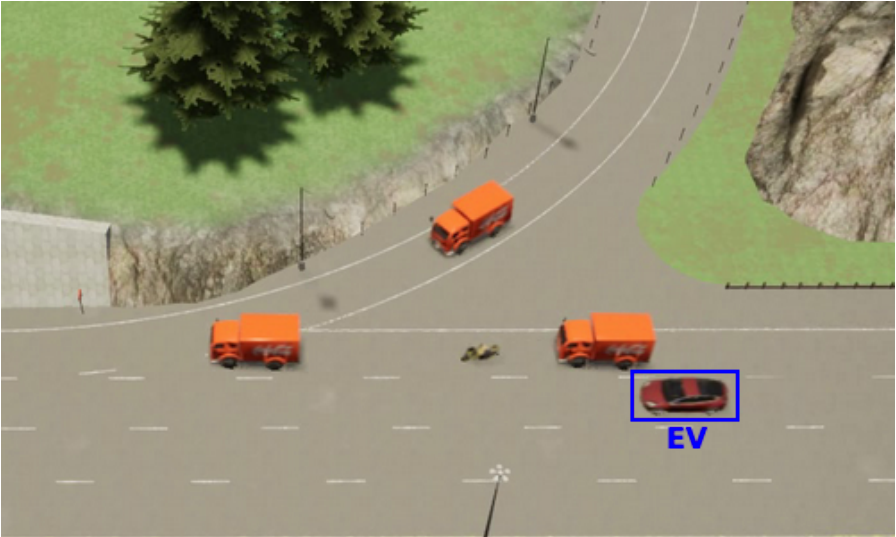

# Mauro Comi
---

I am a PhD student in **Machine Learning** at the [University of Bristol](https://www.bristol.ac.uk/) (UK). My research interests lie at the intersection of **Reinforcement Learning**, **3D Deep Learning**, **robotics perception**, and **physics simulation**. I have a soft spot for computer graphics and physically-based rendering, and I like to keep up with research in this area as a side-interest. Previously, I worked as a Machine Learning research engineer in autonomous driving at the Netherlands Organisation for Applied Scientific Research (TNO).

I read papers following Andrew Ng's invaluable tips on <a href="https://youtu.be/733m6qBH-jI">How to read research papers (Andrew NG)</a>

## Publications

| |[A Hybrid-AI approach to Competence Assessment for Automated Driving Functions](http://ceur-ws.org/Vol-2808/Paper_37.pdf), Jan-Pieter Paardekooper, **Mauro Comi**, Corrado Grappiolo, Ron Snijders, Willeke van Vught, Rutger Beekelaar, *SafeAI AAAI 2021* |

## Teaching
- **[Introduction to AI](https://www.bris.ac.uk/unit-programme-catalogue/UnitDetails.jsa?ayrCode=22%2F23&unitCode=EMATM0044), Teaching Assistant**, MSc unit, @University of Bristol, 2021/2022
- **Anomaly Detection using Machine Learning, Guest Lecturer** @Jheronimus Academy of Data Science, July 2021

## Talks
- **A Hybrid-AI approach to Competence Assessment for Automated Driving Functions** @SafeAI AAAI, February 2021

## Updates

- In September 2021, I started my PhD in Machine Learning at the University of Bristol! 
- Our work *A Hybrid-AI approach to Competence Assessment for Automated Driving Functions* was accepted at SafeAI AAAI 2021.
- In November 2019, I graduated Cum Laude in Data Science with a MSc thesis on Deep RL for physically-based rendering.
- In April 2019, I started to work as Machine Learning research engineer at the Netherlands Organisation for Applied Scientific Research (TNO).

