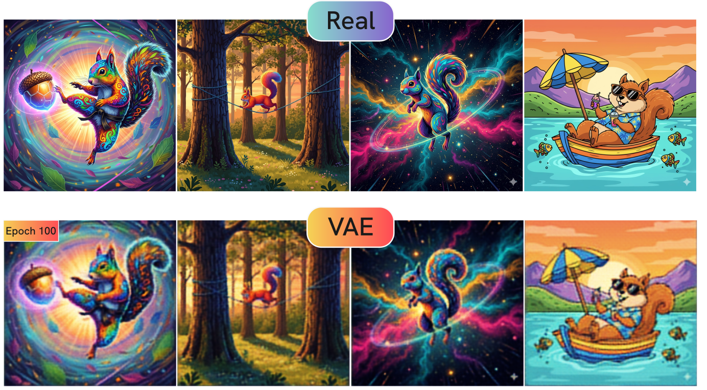
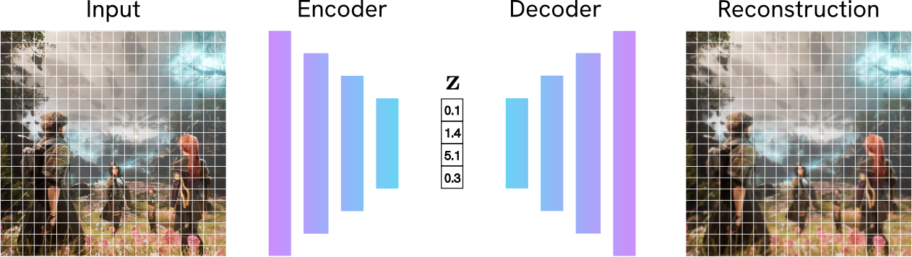
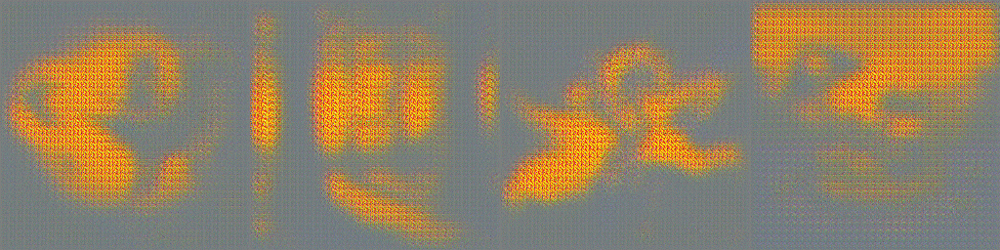

     

 

    <strong>Table of Contents</strong>
    <ul style="padding-left: 20px;">
        <li><a href="#what-is-a-vae">What is a VAE and why is it important?</a>
            <ul>
                <li><a href="#the-big-picture">The Big Picture</a></li>
                <li><a href="#step-1-the-encoder">Step 1: The Encoder</a></li>
                <li><a href="#step-2-the-latent-space">Step 2: The Latent Space and Reparameterization Trick</a></li>
                <li><a href="#step-3-the-decoder">Step 3: The Decoder</a></li>
            </ul>
        </li>
        <li><a href="#the-loss-function">Deconstructing the VAE Loss</a></li>
        <li><a href="#training">Training</a></li>
        <li><a href="#conclusion">Conclusion</a></li>
    </ul>

This blog post is part of a series of **Implementations from Scratch**, covering the major advancements in AI.
**Important resources**:
- <a href="https://github.com/maurock/vaex">  Github code for this blog post </a>
- 

<h4 id="what-is-a-vae"># What is a VAE and why is it important?</h4> 

Models like Stable Diffusion generate high-resolution images quickly because they don't work in the huge pixel space of high-resolution images. Instead, they work in a tiny latent space learnt by a Variational Autoencoder (VAE). This **Latent Diffusion** technique is the standard for modern image generation, and it all depends on a powerful VAE.

If you've read the previous post on [Vision Transformers from Scratch](www.maurocomi.com/blog/vit.html), you'll know that images of squirrels floating in space are a quintessential element of any serious AI blog post. Let's consider many different images of squirrels: some are floating in space, some are chilling on trees, others are [hiding acorns and later forgetting where the acorns are stored](https://www.britannica.com/story/is-it-true-that-squirrels-forget-where-they-bury-about-half-of-their-food). **Our goal** is generate new images that are similar, but not identical, to the pictures in this dataset. We want to generate images that *plausibly could have come* from our dataset. In technical terms, we want to learn the underlying probability distribution of our data. If our dataset was very big, like the entire Internet, we could generate (and reconstruct) all kinds of plausible images! 

To do this, we can't just memorize pixels. We need to learn the structure of our data (the "squirrel-ness", the "tree-ness", and so on) as a and a **compressed** and **meaningful representation**. This representation is called the **latent space**. 

This is where the **Variational Autoencoder (VAE)** comes in. In this post, we'll build a complete VAE from scratch. We will step through an implementation of its architecture and learn the theory behind it along the way. We'll build a modern convolutional VAE, including ResNet blocks and Normalization layers. Although the specific flavor of VAE used in SOTA diffusion models is more sophisticated (e.g. the VQ-VAE used by Stable Diffusion 3), this implementation is a great starting point to understand more advanced variations. The VAE is a very important component of modern generative models, including Diffusion Models (which we'll explore soon!), so it's very important to fully understand it before moving to more complex concepts.

<h4 id="the-big-picture"># The Big Picture</h4> 
You might be familiar with a **standard Autoencoder (AE)**. It's a network with two simple jobs:

- **Encoder**: Compresses an input $\mathbf{x}$ into a small "bottleneck" vector (the latent code) $\mathbf{z}$.
- **Decoder**: Reconstructs the original image $\mathbf{\hat{x}}$ from the vector $\mathbf{z}$.

The AE trained to make the reconstruction $\mathbf{\hat{x}}$ as close to the original $\mathbf{x}$ as possible (for example, by minimizing $L_1$ or $L_2$ pixel loss).

     

  
While this is great for compression, it's terrible for generation! Why? The latent space $\mathbf{z}$ it learns has no structure. The encoder can learn to map "tall chair" to, for example, `[1.2, -0.4]` and "small chair" to `[5.6, 3.1]`. These points might be far apart, and the space between them is meaningless. If you pick a point in the middle, say `[3.4, 1.35]`, and feed it to the decoder, you won't get a "medium chair", but a meaningless bag of pixels. This is because the AE was never forced to make the latent space continuous or organized.

A **Variational Autoencoder** solves this. On a very high level, a VAE is similar to an AE: it receives an input, such as an image, and learns to reconstruct it. But the magic is in *how* this reconsruction is performed. There are some differences with the AE we've described above:

- Instead of compressing an image to a single point (e.g., `[1.2, -0.4]`), the VAE says: "The features for this image are around `[1.2, -0.4]` with some uncertainty". In practice, this means that the VAE Encoder outputs the parameters of a probability distribution (specifically, a mean $\mu$ and a log-variance $\log \sigma^2$) for each latent dimension. This makes generation of new images easier, and the model more robust to noise in the input. 
- The VAE's goal is more nuanced than the goal of an AE. A VAE forces the network to do two things at once: (1) Reconstruct the image well, and (2) keep the latent space organized, smooth, and centered. This creates a structured space where interpolation is meaningful.

On a more formal note, a VAE learns to encode high-dimensional data, like images, into a low-dimensional continuous latent space, and then decode from that space to generate new data.

A VAE is composed of three main parts:
- Encoder: a neural network that takes an input $\mathbf{x}$ and compresses it. Instead of a vector $\mathbf{z}$, it outputs the parameters for a distribution: a mean vector $\mu$ and a log-variance vector $\log \sigma^2$. For example, if our input is an image `256 x 256 x 3`, where `3` is the number of channels RGB, the encoder might transform this into a lower-dimensional `mu=[32 x 32 x 4]` and `log_var=[32 x 32 x4]`.
- Latent vector: the compressed representation $\mathbf{z}$ of our input. It's some vector that encodes useful information about our dataset. Intuitively, let's consider our dataset of squirrels. The first dimension of our latent vector being the one that encodes the number of stars in our picure, the second whether the squirrel is grey or brown, and so on. We sample a latent vector $\mathbf{z}$ from the distribution $\mathcal{N}(\mu, \sigma^2)$ defined by the encoder. This introduces the "variation" in the VAE.
- Decoder: another neural network that takes the sampled latent vector $\mathbf{z}$ and decodes it into an image $\mathbf{\hat{x}}$.

     

 

  Let's give some better intuition. Imagine we train our VAE with a latent space of only two dimensions: $z_1$ and $z_2$. After training on our squirrel dataset, we might find the VAE has learned a meaningful latent space.
  <ul>
  <li>The $z_1$ axis might learn to represent "location" (from -1.0 = "space" to +1.0 = "tree").</li>
  <li>The $z_2$ axis might learn to represent "action" (from -1.0 = "sleeping" to +1.0 = "hiding acorns").</li>
  </ul>
  Because the VAE forces this space to be continuous and centered around zero, we can now pick a random point from $\mathcal{N}(0, 1)$ (such as `z = [-0.8, -0.9]`) and feed it to our Decoder. It will generate a new, plausible image of a squirrel sleeping in space!

<h4 id="step-1-the-encoder">##Step 1: The Encoder</h4> 
This section on Colab: 

The Encoder's job is to compress the input  $\mathbf{x}$ into a meaningful lower-dimensional representation. Unlike a regular autoencoder, the model outputs parameters of a probability distribution. We assume the features for a given image follow a simple Gaussian distribution, defined by two parameters: a mean $\mu$ and a variance $\sigma^2$. Because using the *variance* or the *log of the variance* has the same effect, we actually adjusts the Encoder to output $\log \sigma^2$. This helps for numerical stability.

Let's define our Encoder. We don't want to just "flatten" the image, because we'd lose all the spatial structure. Instead, we use a Convolutional Neural Network (CNN) to preserve spatial structure. Our Encoder, defined in `difftax/vae.py`, is a stack of convolutional layers and `ResNetBlocks` that progressively downsample the image.
- `nnx.Conv`: these layers scan the image with filters, learning to detect patterns (edges, textures, shapes). We use a `strides=2` to cut the height and width in half at several steps, which is how we achieve the compression.
- `ResNetBlock`: a block we define to connect the convolutional layers with skipping connections. Skip connections (the `x + residual` part) are very important. They help gradients flow during training and allow us to build deeper networks. In our code, a `ResNetBlock` consists of `GroupNorm` (a modern alternative to `LayerNorm`), `silu` (a smooth activation function), and two convolutional layers. Here's the code:
<pre class="code-block-pastel"><code class="language-python">
def ResNetBlock(
    x: Float[Array, "B H W C"], conv: nnx.Module, rngs: nnx.Rngs
) -> Float[Array, "B H W C"]:
    """A single ResNet block with two convolutional layers and a skip connection."""

    residual = x

    # Normalize, activate, then convolve
    x = nnx.GroupNorm(num_groups=8, num_features=x.shape[-1], rngs=rngs)(x)
    x = nnx.silu(x)
    x = conv(x)

    # Repeat
    x = nnx.GroupNorm(num_groups=8, num_features=x.shape[-1], rngs=rngs)(x)
    x = nnx.silu(x)
    x = conv(x)

    return x + residual
    </code>
</pre>

    What is <strong>GroupNorm?</strong>
    

        
<i>Click for details</i>

        
GroupNorm is a normalization layer, similar to BatchNorm and LayerNorm.
        <ul>
        <li>BatchNorm normalizes across the <b>batch</b>. This works well, but its performance depends on the batch size (so it's unstable for small batches).</li>
        <li>LayerNorm normalizes across all <b>features/channels</b> for a single sample. This is independent of batch size, but aggregates all channels together.</li>
        <li>GroupNorm is a compromise. It splits the channels into smaller groups (e.g., 32 channels into 8 groups of 4) and normalizes within each group for a single sample. It's independent of the batch size (like LayerNorm) but more flexible.</li>
        </ul>
        

    

    What is <strong>SiLU?</strong>
    

        
<i>Click for details</i>

        
SiLU stands for Sigmoid-weighted Linear Unit, also known as the <b>Swish</b> function. The formula is $f(x) = x \cdot \sigma(x)$, where $\sigma(x)$ is the sigmoid functions. It often performs slightly better than ReLU because it allows small negative values, which helps the gradient flow.

    

Now, let's define our Encoder and trace the tensor dimensions, assuming an input image of `(B, 256, 256, 3)` (where `B` is the batch size), and a `latent_feature=4`:

<pre class="code-block-pastel"><code class="language-python">
class Encoder(nnx.Module):
    def init(self, ...):
        # ... (Conv layer initializations) ... 
        self.conv0 = nnx.Conv(in_features=3, out_features=32, ...)
        self.conv1 = nnx.Conv(in_features=32, out_features=32, ...)
        self.conv2 = nnx.Conv(in_features=32, out_features=64, strides=2, ...)
        self.conv3 = nnx.Conv(in_features=64, out_features=64, ...)
        self.conv4 = nnx.Conv(in_features=64, out_features=128, strides=2, ...) 
        self.conv5 = nnx.Conv(in_features=128, out_features=128, ...) 
        self.conv6 = nnx.Conv(in_features=128, out_features=2 * latent_features, strides=2, ...)

    def __call__(self, x: Float[Array, &quot;B H W C&quot;]):
        # x shape: (B, 256, 256, 3)
        x0 = self.conv0(x)  # (B, 256, 256, 32)
        x1 = ResNetBlock(x0, self.conv1, self.rngs)  # (B, 256, 256, 32)
        x2 = self.conv2(x1)  # (B, 128, 128, 64)
        x3 = ResNetBlock(x2, self.conv3, self.rngs)  # (B, 128, 128, 64)
        x4 = self.conv4(x3)  # (B, 64, 64, 128)
        x5 = ResNetBlock(x4, self.conv5, self.rngs)  # (B, 64, 64, 128)

        # Final layer outputs 2 * latent_features, one for mu, one for log_var
        x6 = self.conv6(x5)  # (B, 32, 32, latent_features*2)
        
        # Split the final output channel-wise
        mu = x6[..., : self.latent_features]  # (B, 32, 32, 4)
        log_var = x6[..., self.latent_features :]  # (B, 32, 32, 4)

        return mu, log_var
    </code>
</pre>
That's it. We feed in an image of shape `(256, 256, 3)`, and get back two smaller tensors: `mu` and `log_var`, each of shape `(32, 32, 4)`. This is our probabilistic latent representation.

<h4 id="step-2-the-latent-space">##Step 2: The Latent Space and the Reparametrization Trick</h4> 

We have one last problem. Our encoder gives us $\mu$ and $\log \sigma^2$, which is not a latent vector per se. The next step is to sample our latent vector $\mathbf{z} \sim \mathcal{N}(\mu, \sigma^2)$. **Problem**: sampling is a random operation. When we train our network using backpropagation, we need to send gradients backward through all the operations. Gradients cannot flow through a random sampling node, as it would be like asking "what's the derivative of picking a random number?".

The solution is adopting the Reparameterization Trick. We restructure the equation to isolate the randomness form the $\mu$ and $log \sigma^2$ parameters, which depends on our network parameters:
1) We generate a random number epsilon ($\epsilon$) from the simple distribution $\mathcal{N}(0, 1)$. This random number has nothing to do with our network's parameters, so we don't need to differentiate through it.
2) We scale this random number by our network's predicted standard deviation ($\sigma$) and shift it by our network's predicted mean ($\mu$):

$\$
\mathbf{z} = \mu + \sigma \odot \epsilon
$\$

This is great, because it's fully differentiable with respect to our network's parameters! The gradient can flow cleanly from $\mathbf{z}$ back to $\mu$ and $\log \sigma^2$ through the simple multiplication and addition. The random part $\epsilon$ is just an external input that doesn't block the gradient path.

<pre class="code-block-pastel"><code class="language-python">
def reparametrization_trick(
    mu: Float[Array, "B H W F"], log_var: Float[Array, "B H W F"], rngs: nnx.Rngs
):
    stdev = jnp.exp(log_var * 0.5)
    epsilon = jax.random.normal(rngs.params(), mu.shape)
    output = mu + stdev * epsilon

    return output
    </code>
</pre>

----
<h4 id="step-3-the-decoder">##Step 3: The Decoder</h4>

The Decoder's job is the reverse of the Encoder: it takes the latent vector $\mathbf{z}$ (shape `(B, 32, 32, 4)`) and reconstructs the original image (shape `(B, 256, 256, 3)`). It's also a CNN, but instead of `nnx.Conv` with `strides=2` (downsampling), it uses `nnx.ConvTranspose` with `strides=2` (upsampling). This "transposed convolution" learns to map a low-resolution feature map to a higher-resolution one, undoing the Encoder's compression. The Decoder in `vae.py` is a symmetric mirror of the Encoder: 
<pre class="code-block-pastel"><code class="language-python"> 
# From vae.py class
class Decoder(nnx.Module):
    def __init__( self, ... ):
        # ... ConvTranspose layer initializations ... 
        self.conv0 = nnx.ConvTranspose(in_features=4, out_features=128, strides=2, ...)
        self.conv1 = nnx.ConvTranspose(in_features=128, out_features=128, ...)
        self.conv2 = nnx.ConvTranspose(in_features=128, out_features=64, strides=2, ...)
        # ... (and so on) 
        self.conv6 = nnx.ConvTranspose(in_features=32, out_features=3, ...)
        
        def __call__(self, x: Float[Array, "B Hi Wi F"]) -> Float[Array, "B H W 3"]:
            # x shape: (B, 32, 32, 4)
            x0 = self.conv0(x) # (B, 64, 64, 128)
            x1 = ResNetBlock(x0, self.conv1, self.rngs) # (B, 64, 64, 128)
            x2 = self.conv2(x1) # (B, 128, 128, 64)
            x3 = ResNetBlock(x2, self.conv3, self.rngs) # (B, 128, 128, 64)
            x4 = self.conv4(x3) # (B, 256, 256, 32)
            x5 = ResNetBlock(x4, self.conv5, self.rngs) # (B, 256, 256, 32)
            
            logits = self.conv6(x5) # (B, 256, 256, 3) # Squeeze the output to be between 0 and 1
            output = nnx.sigmoid(logits)
            return output
</code></pre> 

The final `nnx.sigmoid` activation squashes the output values of the final layer (which could be anything) into the range $[0, 1]$ (the range for normalized pixel values).

The full `VAE` class in `vae.py` just ties these three pieces together: 
<pre class="code-block-pastel"><code class="language-python">
# From vae.py class VAE(nnx.Module): 
# (init Encoder and Decoder)

def __call__(self, inputs: Float[Array, "B Hi Wi C"]) -> Float[Array, "B Ho Wo D"]:

    # Encode
    mu, log_var = self.encoder(inputs)

    # Sample from the latent space
    z = reparametrization_trick(mu, log_var, self.rngs)

    # Decode
    output = self.decoder(z)

    return output, mu, log_var
</code></pre>

<h4 id="the-loss-function"># Deconstructing the VAE Loss</h4>
 
This is the most important part of the VAE. To train this, we need a loss function that achieves two goals:
1. Reconstruct the input image
2. Organize the latent space

We've covered the *what* and *how* of the VAE architecture. To understand *why* it works, we need to deconstruct its loss function.

Our true goal is not just to reconstruct an image, but to model the probability of our data $p(\mathbf{x})$. Let's also define some latent vector $\mathbf{z}$ on which our data depends. What do we mean by this? We're saying that the image $\mathbf{x}$ (the squirrel) isn't just a random collection of pixels, but it was generated from some high-level concepts. The latent vector $\mathbf{z}$ is our attempt to capture those concepts in a compressed numerical form. 

If a random variable $\mathbf{x}$ depends on $\mathbf{z}$, we can express $p(\mathbf{x})$ as:
$\$
p(\mathbf{x}) = \int p(\mathbf{x}\|\mathbf{z})p(\mathbf{z}) dz
$\$
Well, that's not helpful. Even if we assume that we could model $p(\mathbf{x}\|\mathbf{z})$ and that we know $p(\mathbf{z})$, how do we integrate over **all** possible latent codes $\mathbf{z}$ that could have generated $\mathbf{x}$? This integral is a massive high-dimensional calculation that is computationally intractable. We need to find an alternative.

Let's quickly pop back to the 18th century and glance at what Thomas Bayes think about this. According to Bayes' rule:

$\$
p(\mathbf{x}) = \dfrac{p(\mathbf{x}\|\mathbf{z})p(\mathbf{z})}{p(\mathbf{z}\|\mathbf{x})}
$\$

Again, not terribly helpful: 
- We know $p(\mathbf{z})$. Or rather, we choose it! $p(\mathbf{z})$ is the prior distribution of our latent space. This is our assumption about what the "squirrel-ness" of our image should look like, before we've seen any data. We define $p(\mathbf{z})$ to be something very simple and well-behaved, like a standard multivariate Gaussian (Normal) distribution with a mean of zero and an identity covariance matrix $p(\mathbf{z}) = \mathcal{N}(\mathbf{z} \| 0, \mathbf{I})$. What does this mean in practice? We are forcing our VAE to learn an organized latent space. We want all the encoded squirrels floating in space to cluster together in a simple continuous "cloud", well separated from the images of squirrels chilling on trees. Why? This makes the generative process much easier. If the space of squirrels floating in space is a simple cloud, we can easily sample a new $\mathbf{z}$ from it (just pick a random point from the Gaussian cloud) and know that our Decoder can turn it into a plausible-looking squirrel floating in space.
- We know $p(\mathbf{x} \| \mathbf{z})$. Why? This is a function that we can learn. In our model, this will be our **Decoder**. It's a neural network that takes some vector $\mathbf{z}$ (which we can sample, since *we* define $p(\mathbf{z})$!) and outputs a reconstructed $\mathbf{\hat{x}}$.
- We don't know $p(\mathbf{z}\|\mathbf{x})$.

This is a problem for which we have a solution. Let's introduce some function $q_\phi$ that approximates $p(\mathbf{z}\|\mathbf{x})$. Mathematically, we call this our approximate posterior, $q_\phi(\mathbf{z}\|\mathbf{x})$. Well, as we saw earlier, this is our Encoder: a function that receives an input $\mathbf{x}$ and output a probability distribution over $\mathbf{z}$.

We now have a new goal: instead of maximizing the intractable $p(\mathbf{x})$, we want to model $q_\phi(\mathbf{z}\|\mathbf{x})$ so that it gets as close as possible to our real posterior probability $p(\mathbf{z}\|\mathbf{x})$. In other words, we want to minimize the distance between $p$ and $q$. This is equivalent to minimize the Kullback-Liebler divergence, which by definition:

$\$
D\_{KL}(q_\phi(\mathbf{z} \| \mathbf{x}) \parallel p(\mathbf{z} \| \mathbf{x})) = \mathbb{E}\_{q\_\phi(\mathbf{z}\|\mathbf{x})} \left[ \log \frac{q_\phi(\mathbf{z}\|\mathbf{x})}{p(\mathbf{z}\|\mathbf{x})} \right]
$\$

This formula still contains the intractable $p(\mathbf{z} \| \mathbf{x})$, so it doesn't seem helpful. Let's use Bayes' theorem:

$\$
p(\mathbf{z} \| \mathbf{x}) = \frac{p(\mathbf{x} \| \mathbf{z}) p(\mathbf{z})}{p(\mathbf{x})}
$\$

and substitute it into that denominator.

$\$
D\_{KL}(q \parallel p) = \mathbb{E}\_{q\_\phi(\mathbf{z}\|\mathbf{x})} \left[ \log \frac{q\_\phi(\mathbf{z}|\mathbf{x}) \cdot  \textcolor{Emerald}{p(\mathbf{x})}}{\textcolor{Emerald}{p(\mathbf{x}|\mathbf{z})p(\mathbf{z})}} \right]
$\$

Now we use the log rule $\log(A \cdot B) = \log(A) + \log(B)$ to split the fraction:

$\$
D_{KL}(q \parallel p) = \mathbb{E}\_{q\_\phi(\mathbf{z}\|\mathbf{x})} \left[ \log \left( \frac{q\_\phi(\mathbf{z}|\mathbf{x})}{p(\mathbf{z})} \right) - \log p(\mathbf{x}|\mathbf{z}) + \log p(\mathbf{x}) \right]
$\$

Let's expand the expectation $\mathbb{E}_{q}[\ldots]$ over each term:

$\$
D_{KL}(q \parallel p) = \mathbb{E}\_{q\_\phi(\mathbf{z}\|\mathbf{x})} \left[ \log \frac{q\_\phi(\mathbf{z}|\mathbf{x})}{p(\mathbf{z})} \right] - \mathbb{E}\_{q\_\phi(\mathbf{z}\|\mathbf{x})} [\log p(\mathbf{x}|\mathbf{z})] + \mathbb{E}\_{q\_\phi(\mathbf{z}\|\mathbf{x})} [\log p(\mathbf{x})]
$\$

The last term, $\mathbb{E}_{q} [\log p(\mathbf{x})]$, is simple. The expectation is over $\mathbf{z}$ but $\log p(\mathbf{x})$ doesn't depend on $\mathbf{z}$, so it's just a constant: 

$\$
D_{KL}(q \parallel p) =  \mathbb{E}\_{q\_\phi(\mathbf{z}\|\mathbf{x})} \left[ \log \frac{q_\phi(\mathbf{z}\|\mathbf{x})}{p(\mathbf{z})} \right] -  \mathbb{E}\_{q\_\phi(\mathbf{z}\|\mathbf{x})} [\log p(\mathbf{x}\|\mathbf{z})] + \textcolor{Emerald}{\log p(\mathbf{x})}
$\$

Let's re-arrange the equation to solve for $\log p(\mathbf{x})$, which was our original goal:

$\$
\log p(\mathbf{x}) = D\_{KL}(q \parallel p) -  \mathbb{E}\_{q\_\phi(\mathbf{z}\|\mathbf{x})} \left[ \log \frac{q_\phi(\mathbf{z}\|\mathbf{x})}{p(\mathbf{z})} \right] + \mathbb{E}\_{q\_\phi(\mathbf{z}\|\mathbf{x})} [\log p(\mathbf{x}|\mathbf{z})]
$\$

This still looks complicated, so let's flip the signs on the last two terms and regroup:

$\$
\log p(\mathbf{x}) = \underbrace{D_{KL}(q_\phi(\mathbf{z} | \mathbf{x}) \parallel p(\mathbf{z} | \mathbf{x}))}\_{\text{The difference between $q$ and $p$}} + \underbrace{ \mathbb{E}\_{q\_\phi(\mathbf{z}\|\mathbf{x})} \left[\log p_\theta(\mathbf{x}|\mathbf{z})\right] - D_{KL}(q_\phi(\mathbf{z} | \mathbf{x}) \parallel p(\mathbf{z}))}_{\text{ELBO}}
$\$

**This one equation tells us everything we need**:
- $D_{KL}(q_\phi \parallel p(\mathbf{z} \| \mathbf{x}))$ is the KL divergence between our Encoder and the true posterior. This is the distance we wanted to minimize.
- We can't compute it, but we know that a **KL divergence is always greater than or equal to zero**.
- Since the $D_{KL}(q_\phi \parallel p(\mathbf{z} \| \mathbf{x}))$ is always $\ge 0$, we have the inequality: 
$\$
\log p(\mathbf{x}) \ge \mathcal{L}\_{\text{ELBO}} = \mathbb{E}{q_\phi} [\log p_\theta(\mathbf{x}|\mathbf{z})] - D_{KL}(q_\phi(\mathbf{z} | \mathbf{x}) \parallel p(\mathbf{z}))
$\$
- We can't maximize $\log p(\mathbf{x})$ directly, but we can maximize its Lower Bound (the ELBO). By pushing the ELBO up, we are guaranteed to be pushing $\log p(\mathbf{x})$ up as well, **which eventually is what we want**! (it's easy to lose track of our initial goal in between logs and probs)

So, we need to maximize the ELBO. But since our optimizer's job is to minimize a loss, our final VAE loss function is the negative ELBO:

$\$
\mathcal{L}\_{\text{VAE}} = - \mathcal{L}\_{\text{ELBO}} = \underbrace{-\mathbb{E}\_{q_\phi(\mathbf{z}\|\mathbf{x})} [\log p_\theta(\mathbf{x}\|\mathbf{z})]}\_{\text{Reconstruction Loss}} + \underbrace{D_{KL}(q_\phi(\mathbf{z} \| \mathbf{x}) \parallel p(\mathbf{z}))}\_{\text{KL Loss (Regularization)}} 
$\$

This gives us the two components of the VAE loss, which match our two original goals we defined earlier:
- **The Reconstruction Loss** is $-\mathbb{E}\_{q_\phi(\mathbf{z}\|\mathbf{x})} [\log p_\theta(\mathbf{x}\|\mathbf{z})]$. Why? This is telling us how well our Decoder $p_\theta$ can reconstruct the original $\mathbf{x}$ given $\mathbf{z}$. In practice, this loss is a weighted average between an L1-loss and SSIM loss between the predicted and ground truth images (more on this later).
- **The KL Loss** $D_{KL}(q_\phi(\mathbf{z} \| \mathbf{x}) \parallel p(\mathbf{z}))$ acts as a regularizer. This tells us how far our Encoder's output $q_\phi$ is from our simple ideal prior $p(\mathbf{z}) = \mathcal{N}(0, \mathbf{I})$. Intuitively, this loss term acts as a penalty for distributions that are far apart. Also, this term is the reason we have the Encoder output a distribution ($\mu$ and $\sigma^2$) instead of just a single vector $\mathbf{z}$. 

 <strong>Recap</strong>    
Our final loss $\mathcal{L}_{\text{VAE}} = (\text{Reconstruction Loss}) + (\text{KL Loss})$ is a a trade-off: 
<ul>
<li>The <b>Reconstruction Loss</b> pushes the model to be accurate. It wants to pack as much information as possible into $\mathbf{z}$ to make a perfect copy.</li> 
<li>The <b>KL Loss</b> pushes the model to be simple. It wants to throw away information and make all $\mathbf{z}$ vectors look like simple noise ($\mathcal{N}(0, \mathbf{I})$). This organizes the space for good generation.</li> 
</ul>

We have the architecture and the loss function. In practice, the KL divergence between two Gaussian distributions (our $q(z\|x) \sim \mathcal{N}(\mu, \log \sigma^2)$ and our prior $p(z) \sim \mathcal{N}(0, 1)$) has a simple closed-form solution. This is what our `kl_divergence` function calculates:

<pre class="code-block-pastel"><code class="language-python">
# From train.py
def kl_divergence(mu, log_var):
    """The KL divergence between N(mu,sigma) and N(0,I) has a nice closed form."""

    kl = 0.5 \* jnp.sum(
    jnp.power(mu, 2) + jnp.exp(log\_var) - log\_var - 1, axis=(-1, -2, -3)
    )

    return jnp.mean(kl) # Average over the batch
    </code>
</pre>

<h4 id="training">#Training</h4>
We are done! We now need to write our final loss function. In addition to the $D_{KL}$ and the reconstruction loss (which we'll write as a simple L1-loss), we add an SSIM (Structural Similarity index Metric) term. This is a perceptual similarity loss. It's a loss that penalizes the difference "in structure" between two images, rather than the L1 difference between pixels. Perceptual losses are often used within Computer Vision algorithms as they empirically result in much more accurate results. THe reason is a bit nuanced and out of scope, but in short, the model can easily "game" the L1/MSE score to get low losses despite of poor perceptual qualities. 

Our loss function is:

<pre class="code-block-pastel"><code class="language-python">
@nnx.value_and_grad
def vae_loss_fn(
    model: vae.VAE,
    batch: Float[Array, "B H W C"], # Our images
    lambda_rec: float,
    lambda_ssim: float,
    lambda_kl: float,
):
    output, mu, log_var = model(batch)
    reconstruction_loss = l1(batch, output)
    ssim_loss = 1 - ssim(batch, output).mean()
    kl_loss = kl_divergence(mu=mu, log_var=log_var)

    total_loss = lambda_rec * reconstruction_loss + lambda_ssim * ssim_loss + lambda_kl * kl_loss

    return total_loss
    </code>
</pre>

This is where the `jax` magic happens: because we decorate our funciton with `@nnx.value_and_grad`, jax autograd will compute the gradient of our loss function with respect to the first parameter we passed to our function, which is `model`. These gradients are then used by our `optimizer` in the `training_step` method, which processes the loss for a single batch:

<pre class="code-block-pastel"><code class="language-python">
@partial(nnx.jit, static_argnames=("lambda_rec", "lambda_ssim", "lambda_kl"))
def train_step(
    optimizer: nnx.Optimizer,
    model: vae.VAE,
    batch: Array,
    lambda_rec: float,
    lambda_ssim: float,
    lambda_kl: float,
):
    x = batch["image"]
    loss_value, grads = vae_loss_fn(
        model, x, lambda_rec=lambda_rec, lambda_ssim=lambda_ssim, lambda_kl=lambda_kl
    )
    optimizer.update(model, grads)
    return loss_value
    </code>
</pre>

Finally, we use this training step within our much broader trainin loop, which iterates through every single batch in our dataset.

<pre class="code-block-pastel"><code class="language-python">
def run_training(
    model,
    data_loader,
    config
) -> vae.VAE:
    """Run full training."""

    # Initialize the optimizer
    optimizer = nnx.Optimizer(
        model, optax.adamw(learning_rate=config["learning_rate"]), wrt=nnx.Param
    )

    for epoch_idx in range(config["num_epochs"]):
        batch_losses = []
        for i, batch in enumerate(data_loader):
            batch = jax.device_put(batch)
            loss = train_step(
                optimizer,
                model,
                batch,
                lambda_rec=config["lambda_rec"],
                lambda_ssim=config["lambda_ssim"],
                lambda_kl=config["lambda_kl"],
            )

            batch_losses.append(loss)

    return model 
    </code>
</pre>

And \*_drumroll_\* our results after training on a few sample images are:

     

 
Please check a code on Github for the whole Dataset defintion and training loop on 16K images from Hugging Face.

<h4 id="conclusion">#Conclusion</h4>

We made it :) We've gone through the entire process of building a modern Variational Autoencoder from scratch using JAX. We started with a practical implementation of our Encoder, which leverages `ResNetBlocks`, normalization layers, and `ConvNets`. We have seen the core theory of the Evidence Lower Bound (ELBO), and specifically how its two competing goals (reconstruction and regularization) motivates our architecture. Finally, we assembled a complete training pipeline to train bring our model. 

The VAE we've built is a functional baseline. The code on Github defines the whole model, a dataset with 16k images form Hugging Face, the loading/saving weight process. We'll be using this for our next step, which consists in the implementation of a Diffusion Transformer for image generation. 

Thanks for reading, and see you in the next episode!
 
 